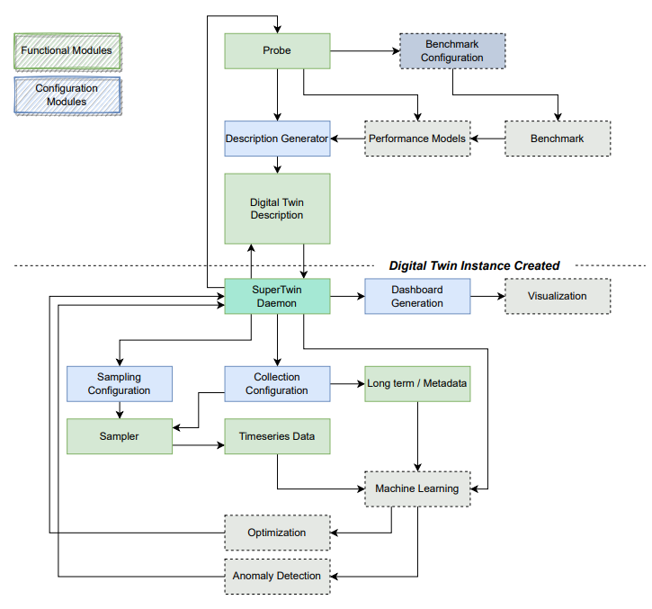
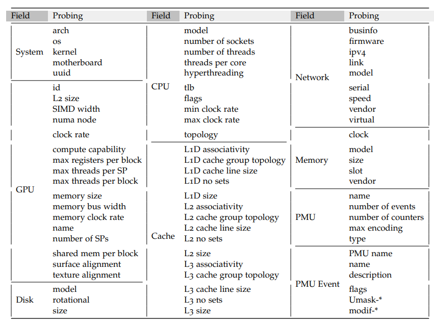
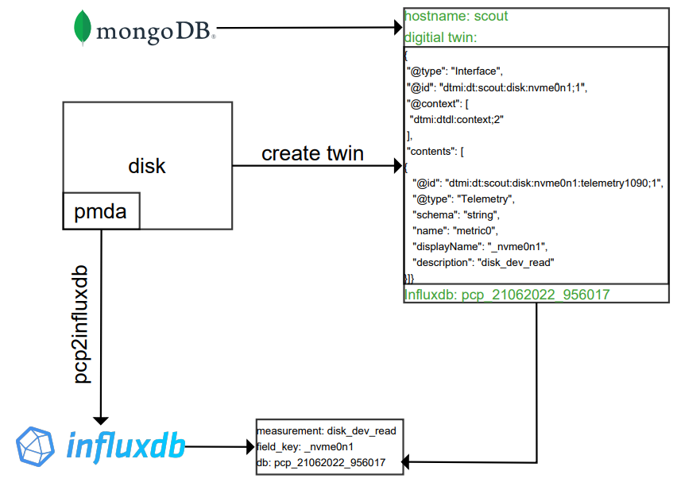

Welcome to Super Twin's documentation!
======================================
Digital SuperTwin
SuperTwin is a digital twin for hig-performance computing clusters which creates a structured data representation over an HPC system, manages data input from a collection of tools and enable reasonings among them. Current capabilities of SuperTwin are:

- Monitoring
- Automated PMU configuration
- Automated profiling
- Modelling
- Knowledge retrieval

**Overview**

SuperTwin creates a Digital Twin Description (DTD) of a target system. It could be used to model, monitor and/or observe both a remote system or local system. However, since large amounts of data are sampled and visualized during the process best use case is to model a remote system.
Since SuperTwin leverages a large collection of tools; it has a large dependency list. Installation of these dependencies are left to the user.

Check out the :doc:`usage` section for further information, including
how to :ref:`installation` the project. :doc:`license`

SuperTwin is
 * generic
 * unified
 * recursive
 * dynamic & configurable
 * modular

The modules of SuperTwin are shown below. Nodes with dashed lines and pale colors are continue to be developed.

The table below demonstrates the data field probed from the machines. 

The data collected is stored in databases based on the data property. The time series data is stored in InfluxDB while metadata is stored in MongoDB.

.. note::

   This project is under active development.

Contents
--------

.. toctree::

   usage
   api
   license
   how_to
   contribution
