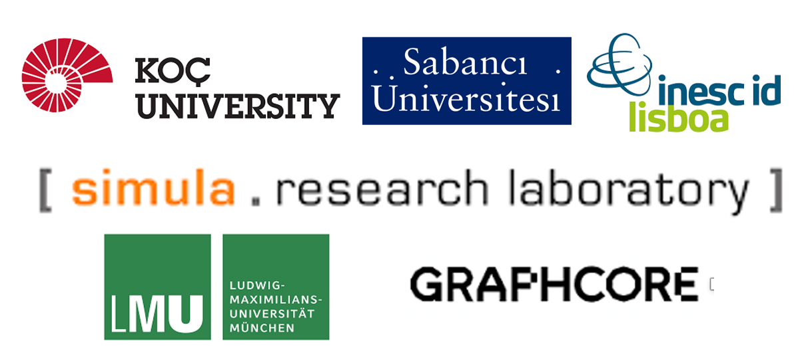

Welcome to Super Twin's documentation!
Emire selam
======================================
Digital SuperTwin
SuperTwin is a digital twin for high-performance computing clusters which creates a structured data representation over an HPC system, manages data input from a collection of tools and enable reasonings among them. Current capabilities of SuperTwin are:

- Monitoring
- Automated PMU configuration
- Automated profiling
- Modelling
- Knowledge retrievals

This real-time super computer monitoring project is a part of SparCity which is an international project where 6 partners from 4 
different countries collaborate with 2.6 M € funding by the European High Performance Computing Joint Undertaking (EuroHPC JU). 
The main project aims to design tools and algorithms for enabling both performance and energy efficiency of sparse computations with 
the application focus on computational science, deep learning and data analytics. 

You can find the collaborators below:

.. note::

   You can reach the SparCity project main web page via this link: https://sparcity.eu/

**Overview**

SuperTwin creates a Digital Twin Description (DTD) of a target system. It could be used to model, monitor and/or observe both a remote system or local system. However, since large amounts of data are sampled and visualized during the process best use case is to model a remote system.
Since SuperTwin leverages a large collection of tools; it has a large dependency list. Installation of these dependencies are left to the user.

Check out the :doc:`usage` section for further information, including
how to :ref:`installation` the project and other useful tutorials at :doc:`how_to` section.

SuperTwin is
 * generic
 * unified
 * recursive
 * dynamic & configurable
 * modular

The modules of SuperTwin are shown below. Nodes with dashed lines and pale colors are continue to be developed.

.. image:: ../images/supertwin_diagram.png
   :width: 600

The table below demonstrates the data field probed from the machines. 

.. image:: ../images/supertwin_probing.png
   :width: 600

The data collected is stored in databases based on the data property. The time series data is stored in InfluxDB while metadata is stored in MongoDB.

.. image:: ../images/supertwin_database.png
   :width: 450

Contents
--------

.. toctree::

   usage
   api
   license
   how_to
   contribution
   q_and_a

.. note::

   This project is under active development.
